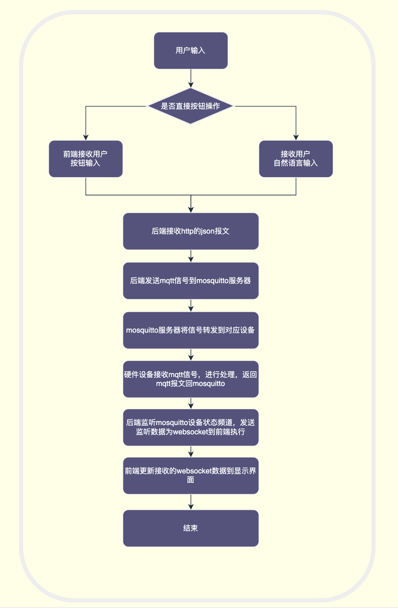
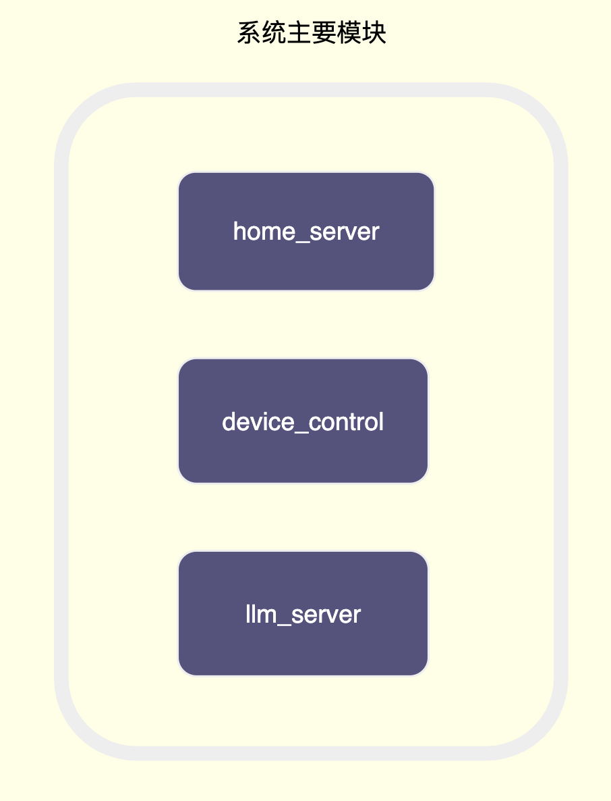
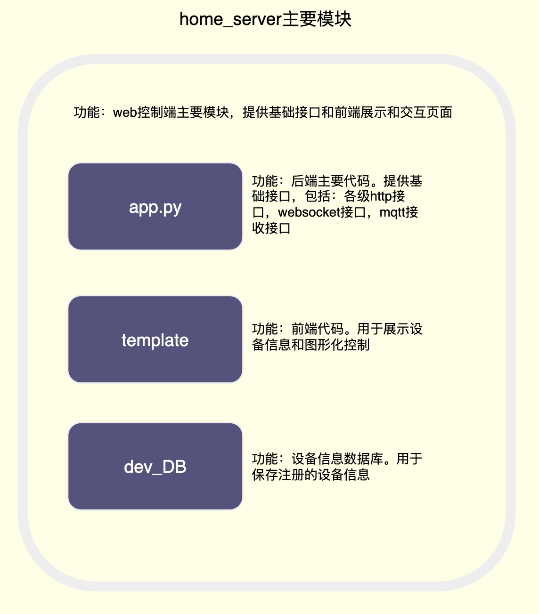
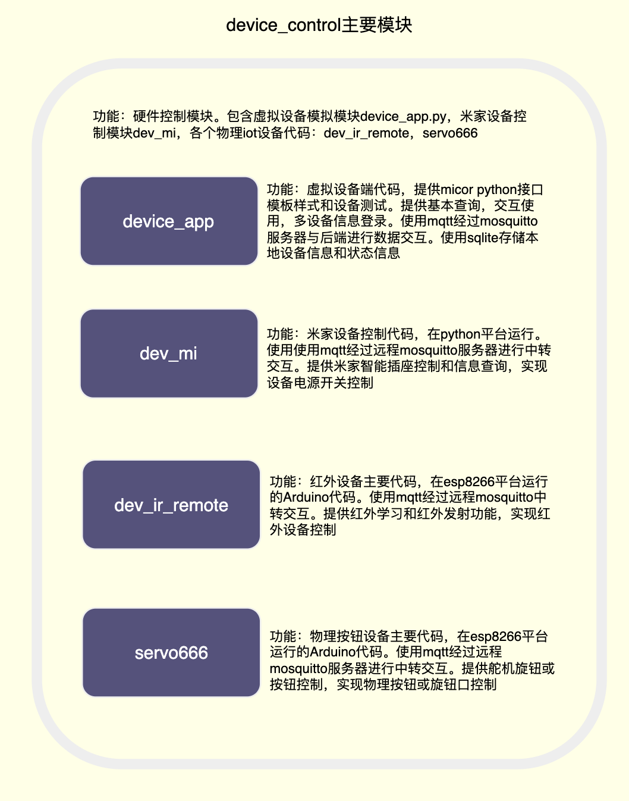
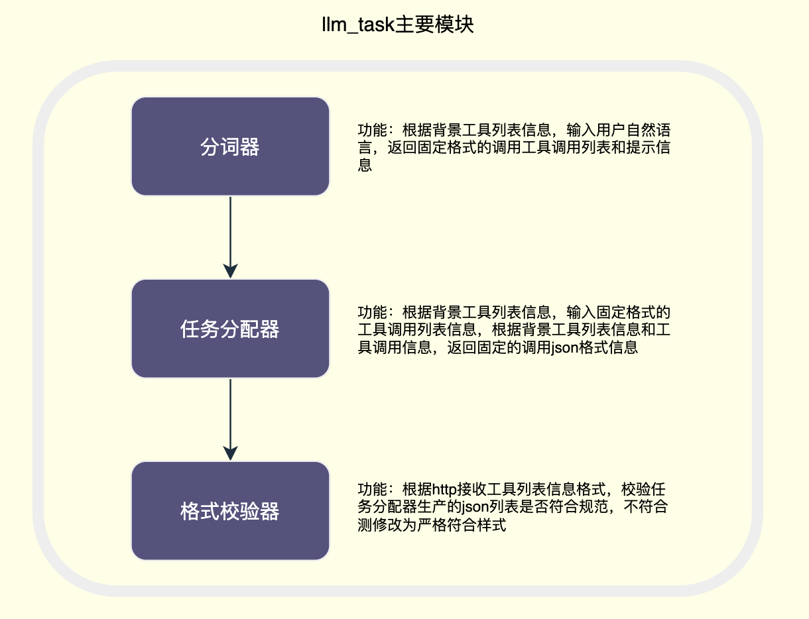

# llm驱动的iot项目

地址：https://github.com/ZoraMing/llm_iot

创建虚拟环境

```bash
# python3.12
python3 -m venv .venv_iot
source .venv_iot/bin/activate
# windows下启动环境
.\.venv_iot\Scripts\Activate.ps1
pip install -r requirements.txt
```


项目结构：

```
========================================
├── home_server/
│   ├── dev_DB/
│   │   ├── __init__.py
│   │   ├── app.db
│   │   ├── db.py
│   │   ├── dev_DB_create.sql
│   │   ├── migrate.py
│   │   └── temp.py
│   ├── templates/
│   │   ├── index.html
│   │   └── indexVue.html
│   ├── app.py
│   ├── config.py
│   ├── device_manger.py
│   └── tmp_config.py
├── llm_task/
│   ├── temp_code/
│   │   ├── fun_agent.py
│   │   ├── fun_tools.py
│   │   ├── llm_getdata.py
│   │   └── llm_mcp.py
│   ├── llm_task.py
│   ├── llm_task_prompts.py
│   ├── llm_task_tools.py
│   └── README.md
├── mqtt_device/
│   ├── dev_ir_remote/
│   │   ├── include/
│   │   │   └── README
│   │   ├── lib/
│   │   │   └── README
│   │   ├── src/
│   │   │   ├── ir_storage.cpp
│   │   │   ├── ir_storage.h
│   │   │   ├── main.cpp
│   │   │   ├── mqtt_tools.cpp
│   │   │   └── mqtt_tools.h
│   │   ├── test/
│   │   │   ├── README
│   │   │   ├── sero.cpp
│   │   │   └── temp.cpp
│   │   ├── .gitignore
│   │   └── platformio.ini
│   ├── mijia_dev/
│   │   ├── jsons/
│   │   │   ├── auth.json
│   │   │   └── devices.json
│   │   ├── __init__.py
│   │   ├── device_mi.py
│   │   ├── mi_plug.py
│   │   └── mijia_contorl.py
│   ├── servo666/
│   │   ├── include/
│   │   │   └── README
│   │   ├── lib/
│   │   │   └── README
│   │   ├── src/
│   │   │   ├── main.cpp
│   │   │   ├── mqtt_tools.cpp
│   │   │   └── mqtt_tools.h
│   │   ├── test/
│   │   │   └── README
│   │   ├── .gitignore
│   │   └── platformio.ini
│   ├── __init__.py
│   ├── config.py
│   ├── device_app.py
│   └── tmp_config.py
├── static/
│   └── img/
├── .gitignore
├── README.md
├── requirements.txt
└── run.py


```
- 前端          indexVue.html
- 服务端        home_server.py
- 设备端        device_server.py
- mqtt服务器    mosquitto











参考https://windsurf.com/blog/what-is-an-agent


