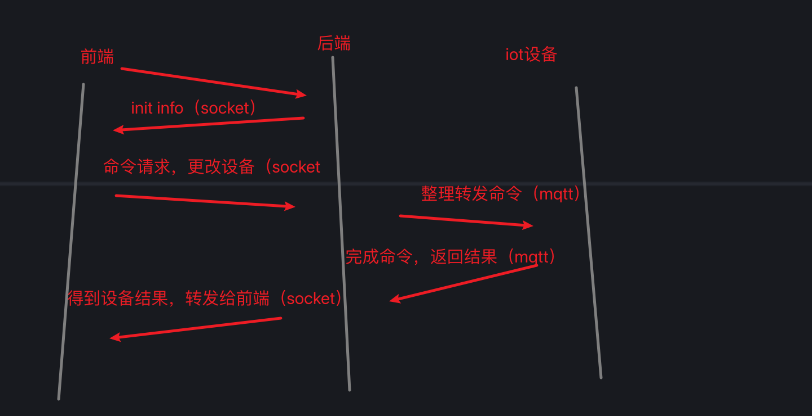

# llm驱动的iot项目

地址：https://github.com/ZoraMing/llm_iot

创建虚拟环境

```bash
# python3.12
python3 -m venv .venv_iot
source .venv_iot/bin/activate
# windows下启动环境
.\.venv_iot\Scripts\Activate.ps1
pip install -r requirements.txt
```


项目结构：

```
README.md
requirements.txt
.gitignore
.venv_iot/..
home_server/
            app.py
            config.py
            device_server.py
            tmeplate/
                indexVue.html
            dev_DB/
                app.db
                db.py
                migrate.py
                dev_DB_create.py
mqtt_device/
            __init__.py
            config.py
            device_app.py
            servo666/
            ir_remote/
static/
        img/
            设备流程甘特图.png


```
- 前端          indexVue.html
- 服务端        home_server.py
- 设备端        device_server.py
- mqtt服务器    mosquitto



参考https://windsurf.com/blog/what-is-an-agent


